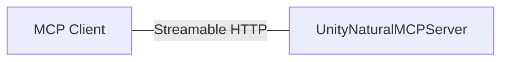
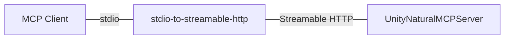
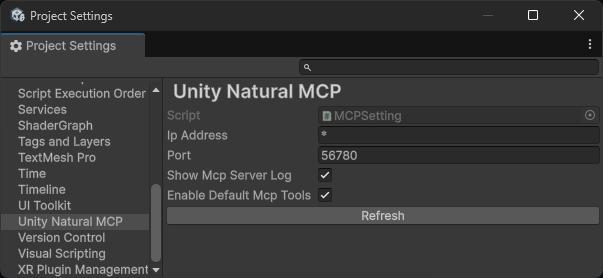
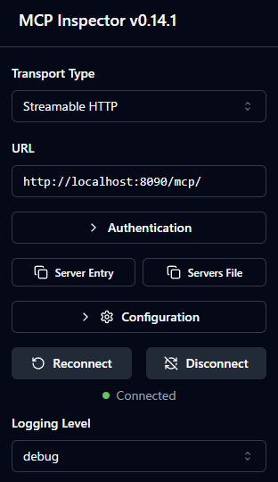

# UnityNaturalMCP


[](https://deepwiki.com/notargs/UnityNaturalMCP)


[English](README.md)

UnityNaturalMCPは、"ナチュラル"な使い勝手を目指した、Unity向けのMCPサーバー実装です。

Unity C#で定義したMCPツールを、ダイレクトにClaudeCodeやGitHub Copilot(VSCode), CursorなどのMCPクライアントから利用できます。

> [!WARNING]
> UnityNaturalMCPは、まだpreview段階です。実用可能ですが、いくつかの機能追加が予定されています。

## Features
- Unity EditorとMCPクライアント間の簡潔な通信フロー
- stdio/Streamable HTTP対応
- [MCP C# SDK](https://github.com/modelcontextprotocol/csharp-sdk)を用いた、C#で完結する拡張MCPツールの実装
- ClaudeCode, GitHub Copilot(VSCode), Cursorなどをサポート

## Requirements
- Unity 6000.0以降
- Node.js 18.0.0以降 (`mcp-stdio-to-streamable-http`を使用する場合)

## Architecture


または



### UnityNaturalMCPServer
Unity Packageとして提供される、 `Streamable HTTP` として振る舞うMCPサーバー実装です。

`Github Copilot(VSCode)` などの `Streamable HTTP` 対応のクライアントであれば、これを介して単体でUnity Editorと通信することができます。

### mcp-stdio-to-streamable-http
[mcp-stdio-to-streamable-http](https://github.com/notargs/mcp-stdio-to-streamable-http)

Node.jsで実装された、MCPクライアントとUnity間の通信を中継する `stdio` ベースのMCPサーバーです。

`Cursor` などの一部のMCPクライアントは、2025/6/23現在、 `Streamable HTTP` に対応していません。

`stdio` の入力を `Streamable HTTP` にバイパスすることで、 `UnityNaturalMCPServer` とMCPクライアントの間の通信を可能にします。

### UnityNaturalMCPTest
機能検証用、サンプルとなるUnityプロジェクトです。

## MCP Tools
現在、次のMCPツールが実装されています。

- **RefreshAssets**: Unity Editorのアセットを更新
- **GetCurrentConsoleLogs**: Unity Consoleのログを取得
- **ClearConsoleLogs**: Unity Consoleのログをクリア
- **RunEditModeTests**: Unity Test RunnerでEditModeテストを実行
- **RunPlayModeTests**: Unity Test RunnerでPlayModeテストを実行

## Installation

### Unity
動作には、次のPackageが必要です。
- [UniTask](https://github.com/Cysharp/UniTask)
- [NugetForUnity](https://github.com/GlitchEnzo/NuGetForUnity)

また、NugetForUnityより、次のNuget Packageをインストールしてください。
- [System.Text.Json 9.0.x](https://www.nuget.org/packages/System.Text.Json/)
- [ModelContextProtocol 0.2.x](https://www.nuget.org/packages/ModelContextProtocol/)
- [Microsoft.Extensions.DependencyInjection 9.0.x](https://www.nuget.org/packages/Microsoft.Extensions.DependencyInjection/)

> [!WARNING]
> ModelContextProtocolはまだpreview段階です。NugetForUnityを介して導入する場合、`Show Prerelease`トグルを有効化する必要があります。

UPM(Unity Package Manager)を介してインストールできます。

- `Packages/manifest.json` を編集
- `dependencies` セクションに以下を追加：
  ```json
  "jp.notargs.unity-natural-mcp": "https://github.com/notargs/UnityNaturalMCP.git?path=/UnityNaturalMCPServer"
  ```

### Initial Setup
1. Unity Editorで`Edit > Project Settings > Unity Natural MCP`を開く
2. MCPサーバーのポート番号を設定（デフォルト: 56780）
3. `Refresh` ボタンをクリックして設定を反映

> [!NOTE]
> `56780`はあくまでデフォルトポートです。プロジェクトに合わせて、自由に変更してください。
> なお、`67 80` はASCII Codeで `CP` を表します。もちろんMCPから来ています。



### Claude Code
次のコマンドを利用して、ClaudeCodeにMCPサーバーを登録します。

```shell
claude mcp add -s project --transport http unity-natural-mcp http://localhost:56780/mcp
```

### WSL2
Windows上でClaude Codeなどを用いてMCPを利用する場合、WSL2を利用する必要があります。

WSL2とUnityの連携を行うためには、WSL2とホストOSのネットワーク設定を適切に行う必要があります。

簡単なアプローチは、ミラーモードを使用して、WSL2とホストOSを接続する方法です。

ミラーモードを有効化するためには、`C:/Users/[username]/.wslconfig`へと以下の設定を追加します。
```ini
[wsl2]
networkingMode=mirrored
```

ミラーモードでは、localhostを介してWSL2とホストOSの間で通信することができます

しかしながら、C#サーバー側でlocalhostにバインドした場合、期待通りに動作せず、接続が失敗する場合があります。

これを回避するためには、Unityの`Edit > Project Settings > Unity Natural MCP`より、IPAddressを`*`に設定し、`Refresh`を実行します。

> [!CAUTION]
> セキュリティ上の観点から、IP Addressに`*`を指定することは本来推奨されません。
> こちらはあくまで簡易的なセットアップ手順を示すものです。
> 環境に応じて、適宜調整を行ってください。

### GitHub Copilot(VSCode)
GitHub Copilot(VSCode)を利用する場合、Streamable HTTPを介した接続が可能です。

`.vscode/mcp.json` に次の設定を追加します。

```json
{
  "servers": {
    "unity-natural-mcp": {
      "url": "http://localhost:56780/mcp"
    }
  }
}
```

### Cursor
Cursorは2025/6/23現在、Streamable HTTPに対応していないため、`stdio`を介して接続する必要があります。
[mcp-stdio-to-streamable-http Releases](https://github.com/notargs/mcp-stdio-to-streamable-http/releases) より、最新の `mcp-stdio-to-streamable-http-*.zip` をダウンロードしてください。

`.cursor/mcp.json`へと次を追記してください。

`path/to/mcp-stdio-to-streamable-http` は、Cloneした `mcp-stdio-to-streamable-http` のパスに置き換えてください。


```json
{
  "mcpServers": {
    "unity-natural-mcp": {
      "command": "node",
      "args": ["path/to/mcp-stdio-to-streamable-http/dist/index.js"],
      "env": {
        "MCP_SERVER_IP": "localhost",
        "MCP_SERVER_PORT": "56780"
      }
    }}
}
```

### Gemini CLI
Streamable HTTPに対応しています。ルートに`.gemini/settings.json`を作成し、以下を記述してください（独自のポート番号にした場合は、`56780`を修正してください）
```json
{
  "mcpServers": {
    "httpServer": {
      "httpUrl": "http://localhost:56780/mcp"
    }
  }
}
```
詳細はGemini CLIのドキュメントを参照してください。  
[Gemini CLI ドキュメント – HTTP ベースの MCP サーバ](https://github.com/google-gemini/gemini-cli/blob/main/docs/tools/mcp-server.md#http-based-mcp-server)


## Custom MCP Tool Implementation

### 1. Create MCP Tool
UnityNaturalMCPでは、[MCP C# SDK](https://github.com/modelcontextprotocol/csharp-sdk)を用いて、C#でMCPツールを実装することができます。

Editor用のasmdefを作成し、次のスクリプトファイルを追加します。

```csharp
using System.ComponentModel;
using ModelContextProtocol.Server;

[McpServerToolType, Description("カスタムMCPツールの説明")]
public class MyCustomMCPTool
{
    [McpServerTool, Description("メソッドの説明")]
    public string MyMethod()
    {
        return "Hello from Unity!";
    }
}
```

### 2. Create MCP Tool Builder
MCPツールをMCPサーバーに登録するためには、`McpBuilderScriptableObject`を継承したクラスを作成します。
```csharp
using Microsoft.Extensions.DependencyInjection;
using UnityEngine;
using UnityNaturalMCP.Editor;

[CreateAssetMenu(fileName = "MyCustomMCPToolBuilder", 
                 menuName = "UnityNaturalMCP/My Custom Tool Builder")]
public class MyCustomMCPToolBuilder : McpBuilderScriptableObject
{
    public override void Build(IMcpServerBuilder builder)
    {
        builder.WithTools<MyCustomMCPTool>();
    }
}
```


### 3. Create ScriptableObject
1. Unity Editorでプロジェクトウィンドウを右クリック
2. `Create > UnityNaturalMCP > My Custom Tool Builder` を選択してScriptableObjectを作成
3. `Edit > Project Settings > Unity Natural MCP > Refresh` から、MCPサーバーを再起動すると、作成したツールが読み込まれます。

### Best practices for Custom MCP Tools

#### MCPInspector
[MCP Inspector](https://github.com/modelcontextprotocol/inspector)から、Streamable HTTPを介してMCPツールを呼び出し、動作確認をスムーズに行うことができます。



#### Error Handling
MCPツール内でエラーが発生した場合、それはログに表示されません。

try-catchブロックを使用して、エラーをログに記録し、再スローすることを推奨します。

```csharp
[McpServerTool, Description("エラーを返す処理の例")]
public async void ErrorMethod()
{
  try
  {
      throw new Exception("This is an error example");
  }
  catch (Exception e)
  {
      Debug.LogError(e);
      throw;
  }
}
```

#### Asynchonous Processing
UnityのAPIを利用する際は、メインスレッド以外から呼び出される可能性を考慮する必要があります。

また、戻り値の型には、 `ValueTask<T>` を利用する必要があります。

```csharp
[McpServerTool, Description("非同期処理の例")]
public async ValueTask<string> AsyncMethod()
{
    await UniTask.SwitchToMainThread();
    await UniTask.Delay(1000);
    return "非同期処理完了";
}
```

## トラブルシューティング

### テスト実行ツールがコネクション切断により失敗する

テスト実行時にドメインの再ロードが発生すると、Unityエディターとの接続が切断され、テスト実行ツールが失敗します。

次の点にご注意ください：

- コンパイルが終わってからテスト実行を指示してください
- ドメインの再ロードを伴うEdit Modeテストは実行しないでください
- Play Modeテストを実行するときは **Edit > Project Settings > Editor > "Enter Play Mode Settings"** でドメインの再ロードをオフに設定してください

## License

MIT License
