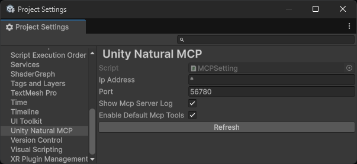
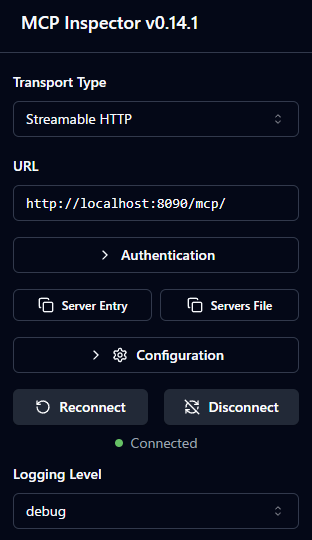

# UnityNaturalMCP


[](https://deepwiki.com/notargs/UnityNaturalMCP)


[日本語](README.ja.md)

UnityNaturalMCP is an MCP server implementation for Unity that aims for a "natural" user experience.

MCP tools defined in Unity C# can be used directly from MCP clients such as Claude Code, GitHub Copilot(VSCode) and Cursor.

> [!WARNING]
> UnityNaturalMCP is still in the preview stage. It is usable in practice, but several feature additions are planned.

## Features
- Concise communication flow between Unity Editor and MCP clients
- stdio/Streamable HTTP support
- Implementation of extended MCP tool entirely written in C# using [MCP C# SDK](https://github.com/modelcontextprotocol/csharp-sdk)
- ClaudeCode, GitHub Copilot(VSCode) and Cursor support

## Requirements
- Unity 6000.0 or later
- Node.js 18.0.0 or later (if using `mcp-stdio-to-streamable-http`)

## Architecture


or


### UnityNaturalMCPServer
An MCP server implementation provided as a Unity Package that behaves as a `Streamable HTTP` server.

Clients that support `Streamable HTTP`, such as `Github Copilot(VSCode)`, can communicate directly with Unity Editor through this server.

### mcp-stdio-to-streamable-http
[mcp-stdio-to-streamable-http](https://github.com/notargs/mcp-stdio-to-streamable-http)

A Node.js-based stdio MCP server that relays communication between MCP clients and Unity.

Some MCP clients, such as `Cursor`, do not support `Streamable HTTP` as of June 23, 2025.

By bypassing stdio input to `Streamable HTTP`, it enables communication between `UnityNaturalMCPServer` and MCP clients.

### UnityNaturalMCPTest
A Unity project for functional verification and as a sample.

## MCP Tools
Currently, the following MCP tools are implemented:

- **RefreshAssets**: Refresh Unity Editor assets
- **GetCurrentConsoleLogs**: Get Unity Console log history
- **ClearConsoleLogs**: Clear Unity Console logs
- **RunEditModeTests**: Run Edit Mode tests on Unity Test Runner
- **RunPlayModeTests**: Run Play Mode tests on Unity Test Runner

## Installation

### Unity
The following packages are required:
- [UniTask](https://github.com/Cysharp/UniTask)
- [NugetForUnity](https://github.com/GlitchEnzo/NuGetForUnity)

Also, install the following Nuget Packages via NugetForUnity:
- [System.Text.Json 9.0.x](https://www.nuget.org/packages/System.Text.Json/)
- [ModelContextProtocol 0.2.x](https://www.nuget.org/packages/ModelContextProtocol/)
- [Microsoft.Extensions.DependencyInjection 9.0.x](https://www.nuget.org/packages/Microsoft.Extensions.DependencyInjection/)

> [!WARNING]
> ModelContextProtocol is still in preview stage. When installing via NugetForUnity, you need to enable the `Show Prerelease` toggle.

You can install via UPM (Unity Package Manager):

- Edit `Packages/manifest.json`
- Add the following to the `dependencies` section:
  ```json
  "jp.notargs.unity-natural-mcp": "https://github.com/notargs/UnityNaturalMCP.git?path=/UnityNaturalMCPServer"
  ```

#### Initial Setup
1. Open `Edit > Project Settings > Unity Natural MCP` in Unity Editor
2. Set the MCP server port number (default: 56780)
3. Click the `Refresh` button to apply the settings

> [!NOTE]
> `56780` is just the default port. Feel free to change it to suit your project.
> Note that `67 80` is the ASCII code for `CP`. Of course, it comes from MCP.



### Claude Code
Use the following command to register an MCP server with ClaudeCode.

```shell
claude mcp add -s project --transport http unity-natural-mcp http://localhost:56780/mcp
```

### WSL2
When using MCP with Claude Code on Windows, you need to use WSL2.

To integrate WSL2 with Unity, you need to properly configure the network settings between WSL2 and the host OS.

A simple approach is to use mirror mode to connect WSL2 and the host OS.

To enable mirror mode, add the following settings to `C:/Users/[username]/.wslconfig`:
```ini
[wsl2]
networkingMode=mirrored
```

In mirror mode, you can communicate between WSL2 and the host OS via localhost.

However, when the C# server binds to localhost, it may not work as expected and connections may fail.

To work around this, set the IP Address to `*` in Unity's `Edit > Project Settings > Unity Natural MCP` and execute `Refresh`.

> [!CAUTION]
> From a security perspective, specifying `*` for the IP Address is not normally recommended.
> This is only meant to show a simplified setup procedure.
> Please adjust accordingly based on your environment.

### GitHub Copilot(VSCode)
When using GitHub Copilot(VSCode), connection via Streamable HTTP is possible.

Add the following configuration to `.vscode/mcp.json`:

```json
{
  "servers": {
    "unity-natural-mcp": {
      "url": "http://localhost:56780/mcp"
    }
  }
}
```

### Cursor
Cursor does not support `Streamable HTTP` as of June 23, 2025.
You need to connect via `stdio`.
Please download the latest mcp-stdio-to-streamable-http from [mcp-stdio-to-streamable-http Releases](https://github.com/notargs/mcp-stdio-to-streamable-http/releases).

Clone this repository and add these snippets to `.cursor/mcp.json`.

Please replace `path/to/mcp-stdio-to-streamable-http` with the path to the cloned `mcp-stdio-to-streamable-http`.


```json
{
  "mcpServers": {
    "unity-natural-mcp": {
      "command": "node",
      "args": ["path/to/mcp-stdio-to-streamable-http/dist/index.js"],
      "env": {
        "MCP_SERVER_IP": "localhost",
        "MCP_SERVER_PORT": "56780"
      }
    }}
}
```

### Gemini CLI
Streamable HTTP is supported. Create `.gemini/settings.json` at the root and add the following (if you use a custom port, replace `56780`):
```json
{
  "mcpServers": {
    "httpServer": {
      "httpUrl": "http://localhost:56780/mcp"
    }
  }
}
```
For more details, see the Gemini CLI documentation:
https://github.com/google-gemini/gemini-cli/blob/c55b15f7/docs/tools/mcp-server.md#http-based-mcp-server


## Custom MCP Tool Implementation

### 1. Create MCP Tool
In UnityNaturalMCP, you can implement MCP tools in C# using the [MCP C# SDK](https://github.com/modelcontextprotocol/csharp-sdk).

Create an asmdef for the Editor and add the following script files.

```csharp
using System.ComponentModel;
using ModelContextProtocol.Server;

[McpServerToolType, Description("Description of custom MCP tool")]
public class MyCustomMCPTool
{
    [McpServerTool, Description("Method description")]
    public string MyMethod()
    {
        return "Hello from Unity!";
    }
}
```

### 2. Create MCP Tool Builder
To register MCP tools with the MCP server, create a class that inherits from `McpBuilderScriptableObject`.
```csharp
using Microsoft.Extensions.DependencyInjection;
using UnityEngine;
using UnityNaturalMCP.Editor;

[CreateAssetMenu(fileName = "MyCustomMCPToolBuilder", 
                 menuName = "UnityNaturalMCP/My Custom Tool Builder")]
public class MyCustomMCPToolBuilder : McpBuilderScriptableObject
{
    public override void Build(IMcpServerBuilder builder)
    {
        builder.WithTools<MyCustomMCPTool>();
    }
}
```


### 3. Create ScriptableObject
1. Right-click in the project window in Unity Editor
2. Create ScriptableObject by Select `Create > UnityNaturalMCP > My Custom Tool Builder`
3. From `Edit > Project Settings > Unity Natural MCP > Refresh`, restart the MCP server to load the created tools.

### Best practices for Custom MCP Tools

#### MCPInspector
From [MCP Inspector](https://github.com/modelcontextprotocol/inspector), you can call MCP tools via Streamable HTTP and perform operational verification smoothly.



#### Error Handling
When errors occur within MCP tools, they are not displayed in logs.

It is recommended to use try-catch blocks to log errors and rethrow them.

```csharp
[McpServerTool, Description("Example of error-returning process")]
public async void ErrorMethod()
{
  try
  {
      throw new Exception("This is an error example");
  }
  catch (Exception e)
  {
      Debug.LogError(e);
      throw;
  }
}
```

#### Asynchonous Processing
When using Unity's API, it is necessary to consider the possibility that it may be called from threads other than the main thread.

Additionally, the return type must use `ValueTask<T>`.

```csharp
[McpServerTool, Description("Example of asynchronous processing")]
public async ValueTask<string> AsyncMethod()
{
    await UniTask.SwitchToMainThread();
    await UniTask.Delay(1000);
    return "Finished async processing";
}
```

## Troubleshooting

### Run tests tool fails due to disconnecting

When a domain reload occurs while running tests, the connection with the Unity editor will be disconnected, and the run tests tool will fail.

Note the following:

- Run tests after the compilation is complete
- Do not run Edit Mode tests that involve domain reloading
- When running Play Mode tests, turn off Reload Domain in **Edit > Project Settings > Editor > "Enter Play Mode Settings"**

## License

MIT License
